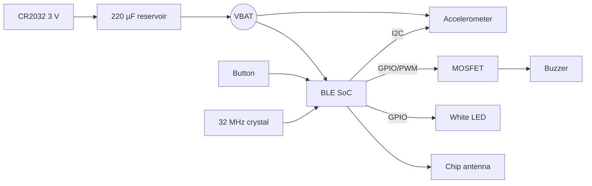

# Architecture: Fixture Tag (fictional example)

```mermaid
flowchart LR
  B1[CR2032 3 V] --> C1[220 µF reservoir] --> VBAT((VBAT))
  VBAT --> U1[BLE SoC]
  VBAT --> U2[Accelerometer]
  U1 -- I2C --> U2
  U1 -- GPIO/PWM --> Q1[MOSFET] --> LS1[Buzzer]
  U1 -- GPIO --> D1[White LED]
  SW1[Button] --> U1
  U1 --> ANT1[Chip antenna]
  Y1[32 MHz crystal] --> U1
```

Single rail: the cell feeds every part directly (VBAT 2.0–3.3 V). No regulator, so every part's supply range must include 2.0 V.
